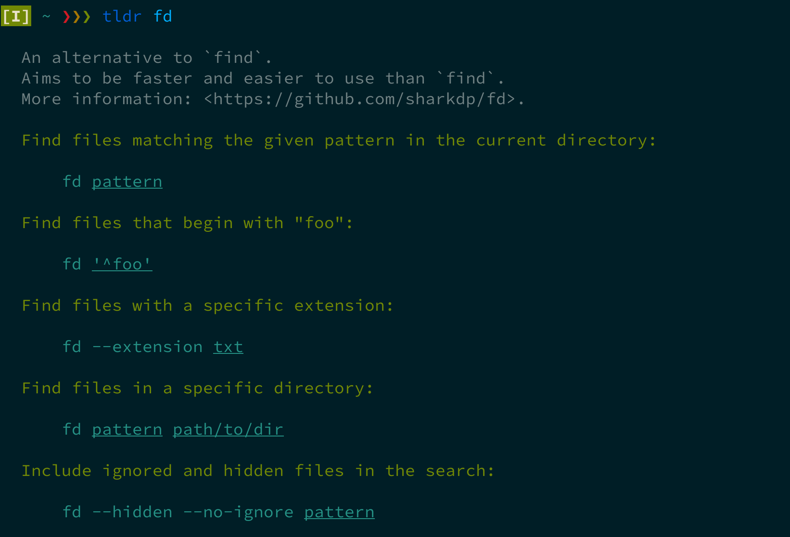

# fd

*A simple, fast and user-friendly alternative to 'find'*

https://github.com/sharkdp/fd

`brew install fd`

- Convenient syntax: `fd PATTERN` instead of `find -iname '*PATTERN*'`
- Supports both regex and glob search
- Smart case
- Ignores hidden directories and files, by default
- Ignores patterns from your .gitignore, by default
- Unicode-aware

---

# unp

*Unpack everything with one command*

`brew install unp`

- Full of perl and shit, but... does the job!
- **WARNING:** `man unp` is a lie, use `unp -h`
- Glorious glory: `unp -s`

---

# tldr / tealdeer

*Simplified, example based and community-driven man pages.*

https://github.com/dbrgn/tealdeer

`brew install tealdeer`

Output of `tldr fd`:

